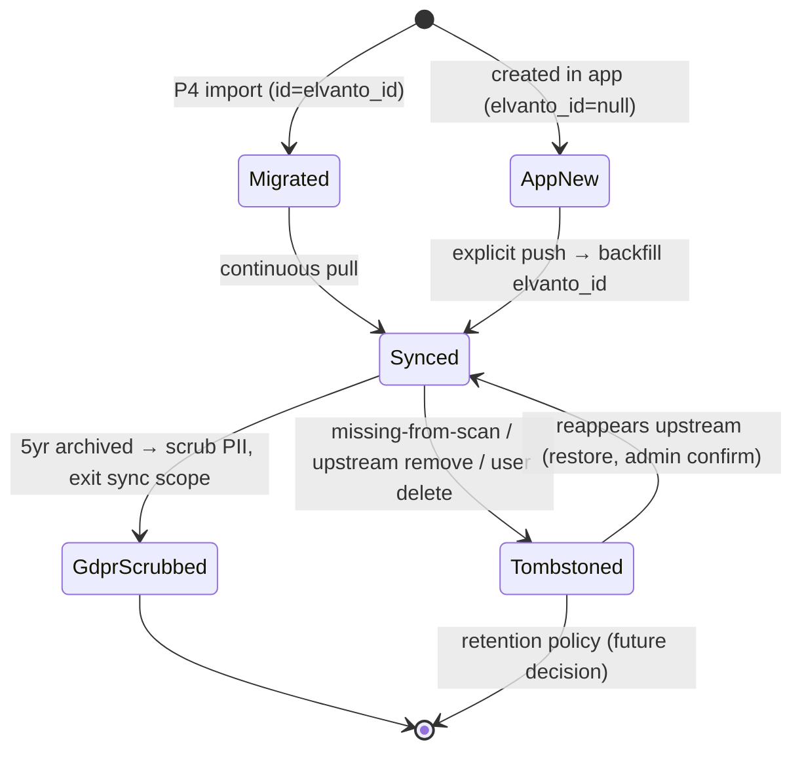

# Compatibility Design — Elvanto→App Migration + Two-Way Sync

**Date:** 2026-08-25 · **Supersedes the "open questions" in `decision-alignment.md` §E with concrete mechanisms.**
**Premise:** the database is built to the decision logs (households, contact channels, journey grid, kindy_start_year, soft delete…), but **all existing data lives in Elvanto** and migrates once. After cutover, both systems stay in sync within each mechanism's documented limits.

---

## 0. Principles

1. **Decision log governs the app model; Elvanto governs only what it owns.** Every synced column gets an explicit owner: `app` · `elvanto` · `shadow` (Elvanto-written, app-readable, never in UI).
2. **Migration adopts Elvanto identity** (IDs, timestamps); divergence starts at cutover, not before.
3. **Write-back stays explicit-action-only** (`sync-design.md` §1). Pull is automatic; push never fires from a cron.
4. **Lossy mappings are allowed but must be declared** in §4's matrix — no silent truncation.
5. **Idempotent, resumable migration** — every phase re-runnable; counts verified against probe totals (5,039 people / 45 groups / 142 songs / 200 services / 199 events).

---

## 1. Identity & primary keys (resolves A-1)

Dual-key scheme on every synced table:

```
id          uuid pk            -- app PK. Migrated rows: = Elvanto UUID. New rows: app-generated UUIDv7.
elvanto_id  uuid unique null   -- sync join key. Migrated rows: same as id. App-origin rows: null until first push.
```

Rules:
- **All sync joins use `elvanto_id`, never `id`.** Elvanto-side ID references inside payloads (category_id, family_id…) resolve via this column.
- Migration seeds `id = elvanto_id` → zero remapping of internal Elvanto FKs during import.
- App-created rows (admin invite form) get `id = uuidv7()`, `elvanto_id = null`, and are **excluded from pull-matches** until pushed. Push happens only on explicit user action; `people/create` response `{id}` backfills `elvanto_id`.
- Contact-only parents (people #46–47) are app rows with `elvanto_id = null` → naturally not synced until an admin explicitly pushes them.

## 2. Households ⇄ Elvanto families (the model case)

**Reality:** Elvanto has no family endpoints — `family_id` (int) is only readable from person objects and writable only via `people/create|edit` (`family_id: <int>` joins, `"new"` creates, blank-but-present removes). No rename, merge, delete, or address-on-family exists upstream.

**Mechanism:**

```dbml
Table households {
  id uuid [pk]                       // app UUID
  elvanto_family_id integer [unique] // captured at migration or on first push
  name varchar                        // app-only label ("The Smith Family")
  deleted_at timestamptz
}
Table addresses {
  id uuid [pk]
  household_id uuid [ref: > households.id]
  line1 varchar
  line2 varchar
  suburb varchar
  state varchar
  postcode varchar
  kind address_kind                   // home | postal (app extensible)
}
```

| Operation | How it works |
|---|---|
| **Migrate** | One household per distinct `people.family_id`; members linked via `people.household_id`. `elvanto_family_id` = that int. Household name derived `"{Surname} Family"` (editable). |
| **Pull membership change** | Person's `family_id` changes upstream → move `household_id` to household with matching `elvanto_family_id`; if unseen int → auto-create household shell + review flag. |
| **Create household in app** | Local-only until a member is pushed. On member push, send `family_id: "new"` → capture returned int into `households.elvanto_family_id`. Subsequent members pushed with that int. |
| **Move person between households (app)** | Explicit action → `people/edit {id, family_id: <target int>}`. |
| **Remove from household** | `people/edit {id, family_id: ""}` (blank-but-present semantics). |
| **Rename / merge / delete household** | **App-only — impossible upstream.** Limitation L-1. |
| **Address** | Owner: `app` for household address. Pull seeds it once from the Primary Contact's `home_*` fields. Push writes the household address to the **Primary Contact only** via `people/edit` fields (`home_address…`) — other members' upstream addresses go stale (L-2). |

Family-role vocabulary: adopted verbatim from Elvanto (`Primary Contact|Spouse|Partner|Child|Sibling|Grandfather|Grandmother|Other`) as the seed list for `people_relationships.relationship_type`, extended app-side with `guardian`, `carer`. Pairwise guardian links are **derived at migration**: parent-type × child-type within a family → `guardian` rows (plus `is_primary` for Primary Contact). Push-back of guardians is limited to keeping `family_relationship` correct on family members; non-resident/contact-only guardians cannot be represented upstream (L-3).

## 3. Journey grid ⇄ categories + locations[] (resolves gap #8)

**One-time seeding algorithm** (migration phase P4):

```
for each migrated person:
  demographic ← normalize(people_category.name)     # adult/youth/child; unmapped → 'adult' + review queue
  for each location L in person.locations[]:
    track ← journey_tracks WHERE elvanto_location_id = L.id
            (auto-create track under seeded category if new)
    stage ← 'archived' if person.elvanto_archived or deceased
            else 'regular' if person.volunteer=1 or person ∈ any group
            else 'contact'
    people.journey[track.id] = stage
  audit(person, field='journey_track', change_reason='migration')
```

Every seeded value is logged with a new `change_reason = 'migration'` so admins can filter the whole batch in the grid and correct en masse. Conservative default (`contact`) understates engagement rather than fabricating it.

**Ongoing ownership:** `journey` is **app-owned** after cutover. Elvanto `locations[]` continues to be pulled into `people.elvanto_locations jsonb` (shadow) for reference/re-seeding, but never writes `journey` automatically. Optional per-track switch `follow_elvanto boolean` (default off): when on, membership add/remove upstream toggles the person on/off that track at stage `contact`. Stages themselves have **no upstream destination — never pushed** (deny-list).

Demographic ⇄ People Category: pull normalizes name→enum. Push maps enum→existing Elvanto category by name; if no matching category exists upstream it **cannot be created** (no category write endpoints) → surfaced as a sync error, not a silent skip (L-4).

## 4. Field-level compatibility matrix

| App field (decision source) | Elvanto counterpart | Owner | Pull rule | Push rule |
|---|---|---|---|---|
| `households` + `addresses` | `family_id` int + person `home_*` block | app | seed/move per §2 | member push w/ family_id; address via Primary Contact |
| `contact_channels(type,value,is_primary)` (#34) | `phone`, `mobile` columns | app | `phone`→channel(home), `mobile`→channel(mobile, primary) | primary mobile channel→`mobile`; primary home channel→`phone` |
| `people.mobile` mirror (auth #56/#58) | `mobile` | shadow | — | maintained by trigger/sync from channels; OTP resolution reads it |
| `journey` JSONB (#38–45) | `locations[]` (+ legacy category) | app | seed per §3; then shadow-only | never |
| `demographic` | People Category name | app | normalize; unmapped→review | map to existing category; missing→sync error (L-4) |
| `marital_status` (incl. `partner`) | enum incl. `Defacto` | app | `Defacto`→`partner` | `partner`→`Defacto`; others identity |
| `kindy_start_year` (#24–25) | `school_grade` string | app | parse "Kindy"/"Year N" → `k = CURRENT_YEAR − N`; unparseable→null+review | derive at write: 0→"Kindy", N→"Year N"; only when Youth/Child |
| `school_name` | *(none)* | app | — | never (deny-list) |
| `access_permission` (#37) | `admin` 0/1 | app | `1`→`Admin` (**promote-only, never demote on pull**) | Admin/SuperAdmin→`1`; others→`0` |
| `custom_fields` JSONB (#4) | `custom_<uuid>` EAV | app | → `elvanto_custom_fields` shadow | app custom_fields never pushed; Elvanto customs pulled to shadow |
| child-safety WWCC/SMT/SMC, consents, medical | *(none)* | app | — | **never leaves the app** (deny-list, privacy) |
| `tags`, `people_tags` | *(none)* | app | — | never |
| `deleted_at` tombstone (core #26) | hard removes; archived flags | app | missing-from-scan → `deleted_at=now()` + audit; `archived=1`/`deceased` → shadows (+ optional journey auto-archive) | explicit user delete → `people/remove` then local tombstone |
| GDPR `deleted_privacy_data` | *(none)* | app | row excluded from all sync once staged | upstream erase = manual admin checklist (L-5) |
| `gender` (blank) | Male/Female/'' | app | ''→null | null→'' |
| giving shadows (`receipt_name`, `giving_number`, `security_code`, `deceased`) | same-name fields | shadow | pull always | future Giving module decides |

## 5. Record lifecycle state machine



## 6. Migration runbook (ordered, idempotent)

| Phase | Action | Verify |
|---|---|---|
| P0 | Create unified schema (app-owned + shadows + mirrors, dual keys, RLS) | migration lint |
| P1 | Reference pulls: people_categories, custom_fields (0 today), song/service/financial categories, calendars | row counts vs probe |
| P2 | People pass: persons → dual-key rows; derive households + addresses (§2); contact_channels; shadows; demographics | **5,039** people; households = distinct family_ids |
| P3 | Groups + memberships (nested people arrays) | 45 groups |
| P4 | Journey seeding algorithm (§3) + `change_reason='migration'` audit rows | every person ≥1 track (#42 CHECK holds) |
| P5 | Flows/steps/members (read-mostly) | counts |
| P6 | Services/times/plans/volunteers/files/notes; songs/arrangements/keys | 200 services ±1y; 142 songs |
| P7 | Calendar events (incl. `"services"` pseudo-calendar events; calendar_id nullable) | 199 events |
| P8 | Financial (currently empty upstream — tables ready, zero rows) | 0 expected |
| P9 | Cutover: enable poll worker; freeze pushes for first cycle; diff report | second-run zero-delta |

Re-run safety: every phase upserts on `elvanto_id`; phases skip already-complete work via `_synced_at`.

## 7. Limitations register (declared lossy/impossible)

- **L-1** Household rename/merge/delete never propagates upstream (no family endpoints).
- **L-2** Address push updates Primary Contact only; other members' upstream addresses stale.
- **L-3** Non-resident / contact-only guardians cannot exist upstream.
- **L-4** New demographic values can't create Elvanto categories (read-only endpoint).
- **L-5** GDPR scrub is local-only; upstream erasure is a manual checklist (extends core Gap #4).
- **L-6** Songs/arrangements/keys have no delete endpoints — app archive only.
- **L-7** Financial categories are create-only upstream; edits/deletes app-local.
- **L-8** Services & flows are read-only mirrors (no write endpoints).

## 8. Amendments this design requires (apply next)

1. `people/decision.md`: extend `people_audit.change_reason` enum with `'migration'` and `'sync'`.
2. `sync-design.md`: §0 partitioning rule; §3 dual-key rewrite; §4 tombstone-not-delete; §6 add §4 mapping table; §7 deny-list additions (journey, tags, child-safety, consents, medical, school_name).
3. `schema.dbml`: apply renames (`elvanto_*` shadows), add `households`, `addresses`, `contact_channels`, `people_relationships`, `tags`, `user_roles`, `journey_*`, `people_audit`, `module_config`, `platform_settings`; add `elvanto_id` to every synced table; make `calendar_events.calendar_id` nullable.
